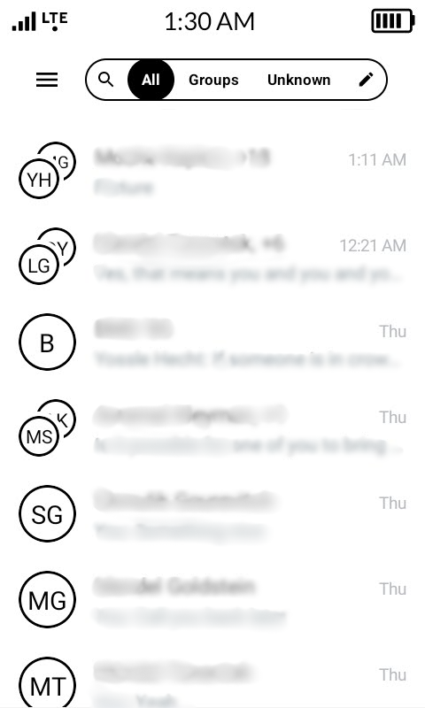
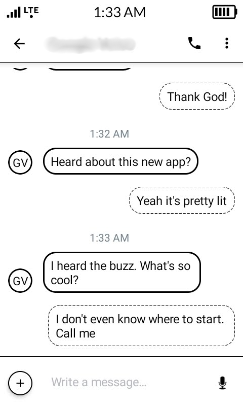

# InkMessage

InkMessage is a cleaned UI for E-ink based on [QUIK messages](https://github.com/octoshrimpy/quik). It focuses on high contrast and simplicity suitable for E-ink displays, while retaining the powerful features of its predecessors.

It is a fork of QUIK, which itself is a continuation of [QKSMS](https://github.com/moezbhatti/qksms).

## Features

- **Optimized for E-ink**: High contrast interface and simplified visuals.
- Scheduled Messages
- Message Backup
- Speech to Text and Text to Speech
- Message Blocking and Archiving
- Voice Messages
- Attachments of any type of file
- Message Sorting
- Delayed Sending

## Download

InkMessage is available to download from the [Releases page](releases).

## Credits & Acknowledgements

InkMessage stands on the shoulders of giants. We owe a massive debt of gratitude to the following projects and developers:

- **QUIK**: Created by [Marcos Jones (octoshrimpy)](https://github.com/octoshrimpy). InkMessage is a direct fork of QUIK.
- **QKSMS**: Created and maintained by [Moez Bhatti](https://github.com/moezbhatti). Both QUIK and InkMessage are built upon the solid foundation of QKSMS.
- **android-smsmms**: Special thanks to Jake ([@klinker41](https://github.com/klinker41)) and Luke Klinker ([@klinker24](https://github.com/klinker24)) for their work on the underlying SMS/MMS library.

## License

InkMessage is released under the **The GNU General Public License v3.0 (GPLv3)**, which can be found in the [LICENSE](LICENSE) file in the root of this project.

[Liberapay](https://liberapay.com/octoshrimpy/donate) | [Ko-Fi](https://ko-fi.com/octoshrimpy/donate) | [Patreon](https://patreon.com/octoshrimpy)

